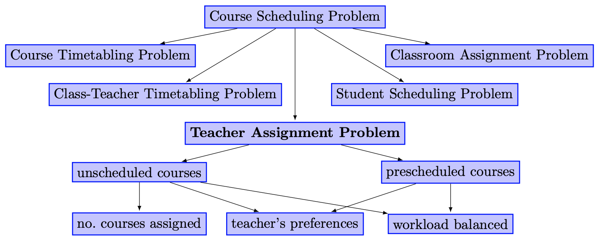

# Genetic-Algorithm-for-Assignment-Problem
A priority of preferences for teacher assignment problem

## Keywords

k-partition; clustering; education 4.0

## Abstract

According to the credit training regulations, students will have to create their own learning path to complete the training program and must actively register for subjects in each of their semesters. To prepare for the student’s course registration, usually at the beginning of each semester, the training department and the head of the department will work together to carry out the following steps: (1) based on the program’s reference road map and individual study plan of students in the upcoming semester, the training department counts the number of classes that need to be opened for each subject (referred to as subject classes) and sends a list of these subject classes to the head of the department, (2) the head of the department assigns the permanent faculty members of the department to be in charge of teaching these subject classes, if not enough, additional visiting lecturers must be invited outside the school, (3) based on the assignment proposed by the head of the department, the training department arranges the timetable for these subject classes, (4) students register for the course on this schedule, then the training department and the head of the department will make adjustments (if any) to suit the student’s actual course registration situation such as opening more subject classes or canceling subject classes, (5) after the final schedule, instruction for that semester will take place.

Currently, in Step 2, the head of the department assigns full-time lecturers in charge of teaching classes difficultly and emotionally. The difficulty is because the number of subject classes is large, as well as the number of full-time lecturers in the subject, and the expertise of the full-time lecturers is very different. The emotionality is because at present there is only one measurable criterion, which is to assign full-time lecturers in charge of subject classes as much as possible so as not to have to invite additional visiting lecturers outside the school. However, the criteria of teacher satisfaction have not been clearly paid attention to.

In this study, the authors propose a quantitative way of teachers’ satisfaction by collecting their interest in subjects through priority for each subject and their maximum teaching capacity in each semester. In fact, some teachers like to teach their familiar subjects, while others like to teach new subjects. Therefore, in this

## Related Work

